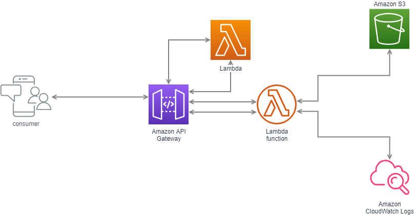

# Geocode - Subprefeituras - SMIT/PMSP

Repositório de um microsserviço destinado a identificar a qual Subprefeitura determinada coordenada pertence, hospedado de modo Serverless na [AWS Lambda](https://aws.amazon.com/pt/lambda/).

## Chamada

- **Produção:** https://geo-api.sp360.in
- **Chamada:** /subprefeitura


## :house: Arquitetura

O esquema abaixo demonstra a arquitetura do microsserviço na nuvem AWS:




## :mag_right: Recursos

### Listar Subprefeitura [/subprefeitura] [GET]

+ Parâmetros
	
	| Parâmetro | Descrição |
	|---|---|
	| `lat` | Latitude da coordenada. |
	| `lng` | Longitude da coordenada. |

+ Request (application/json)
	
	```
	https://geo-api.sp360.in/subprefeitura?lat=-23.550509&lng=-46.633149
	```

+ Response 200 (application/json)

          {
            "id_geosampa": "09", //id utilizado para identificar uma subprefeitura no geosampa [string]
            "id_subprefeitura_mapa": 14, // id utilizado para identificar uma subprefeitura no SP360 [int]
            "nome": "SE", // nome da subprefeitura [string]
          }

### Respostas possíveis

| Código | Descrição |
|---|---|
| `200` | Requisição executada com sucesso (success).|
| `400` | Erros de validação nas coordenadas informadas.|
| `404` | Registro pesquisado não encontrado dentro dos limites do território de São Paulo (Not found).|

	
## :file_folder: Arquivos inclusos [/assets]

- [Shapefiles/\*](assets/Shapefiles): Arquivos shapefiles retirados do [Geosampa](http://geosampa.prefeitura.sp.gov.br/) - Formato SIRGAS_SHP.
- [lambda_layer.zip](assets/lambda_layer.zip): Layer para AWS Lambda, necessária para rodar em modo serverless, com libs (python3.8) do [Geopandas](https://geopandas.org/), [Boto3](https://aws.amazon.com/pt/sdk-for-python/) e dependências.


## :date: Histórico

- 16/11/2020: Primeira versão do código hospedada em Google Colab em Jupyter Notebook
- 18/11/2020: Testes das funções e utilização em batchs para conversão
- 15/04/2021: Criação de função para recuperar os shapefiles através da AWS S3
- 19/04/2021: Handlers e adaptação de código para uso na AWS Lambda
